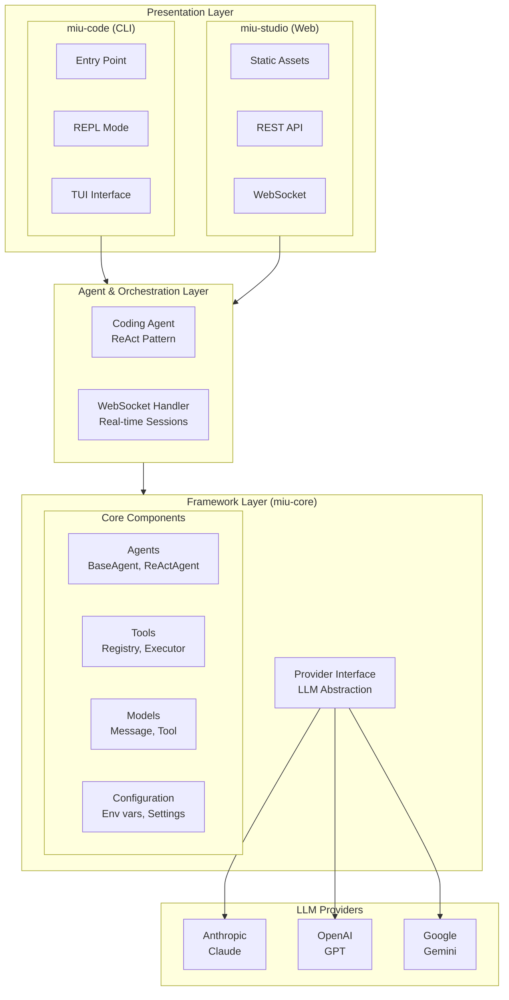
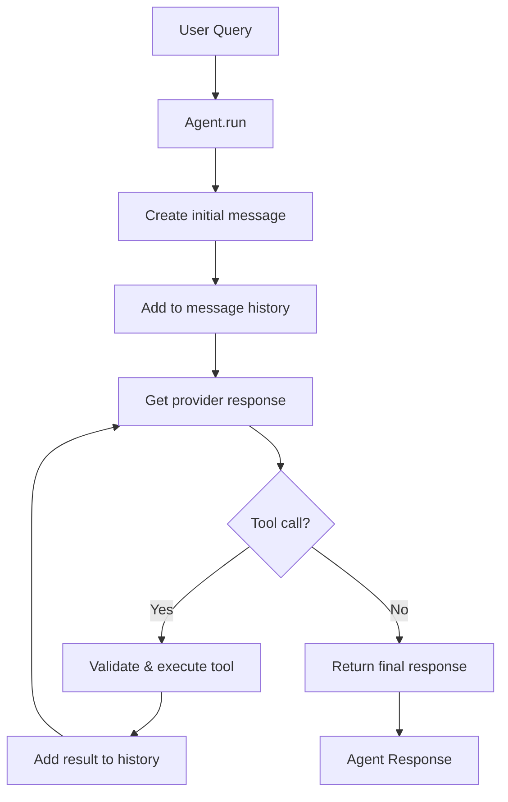

# System Architecture

Miumono follows a layered, modular architecture with clear separation of concerns.

## Overview



## Core Components

### Framework Layer (miu-core)

<Tabs>
  <Tab title="Agents">
    **Location:** `packages/miu_core/miu_core/agents/`

    - **BaseAgent:** Abstract base class defining agent interface
    - **ReActAgent:** Implements ReAct (Reasoning + Acting) pattern

    ```python
    class BaseAgent:
        async def run(self, query: str) -> str:
            """Run agent with given query."""

        async def _execute_step(self, context: AgentContext) -> bool:
            """Execute single step, return True if done."""
    ```
  </Tab>
  <Tab title="Tools">
    **Location:** `packages/miu_core/miu_core/tools/`

    - **BaseTool:** Abstract tool interface
    - **ToolRegistry:** Central tool management

    ```python
    class BaseTool(ABC):
        name: str
        description: str
        parameters: dict[str, Any]

        async def execute(self, **kwargs) -> ToolResult:
            """Execute tool with validated parameters."""
    ```
  </Tab>
  <Tab title="Providers">
    **Location:** `packages/miu_core/miu_core/providers/`

    - **BaseProvider:** Unified LLM interface
    - **AnthropicProvider:** Claude implementation
    - **OpenAIProvider:** GPT implementation
    - **GoogleProvider:** Gemini implementation

    ```python
    class BaseProvider(ABC):
        async def generate(
            self,
            messages: list[Message],
            tools: Optional[list[Tool]] = None,
        ) -> GenerateResponse:
            """Generate response from LLM."""
    ```
  </Tab>
</Tabs>

### Coding Agent Layer (miu-code)

The `CodingAgent` specializes `ReActAgent` for code operations:

| Tool | Purpose | Parameters |
|------|---------|-----------|
| `read` | Read file contents | path: str |
| `write` | Write new file | path: str, content: str |
| `edit` | Modify existing file | path: str, old: str, new: str |
| `bash` | Execute shell command | command: str |
| `glob` | Find files by pattern | pattern: str |
| `grep` | Search file contents | pattern: str, path: str |

### TUI Application (miu-code)

**Location:** `packages/miu_code/miu_code/tui/`

Built with [Textual](https://textual.textualize.io/) framework:

- **StatusBar:** Shows mode, path, token usage
- **Mode Management:** NORMAL → PLAN → ASK cycling
- **Session Control:** New session, clear, quit
- **Real-time Streaming:** Text deltas, tool execution

## Data Flow Patterns

### Agent Execution Flow



### Provider Abstraction

The provider interface allows swapping LLM backends without changing agent code:

```python
# Agent code is provider-agnostic
response = await self.provider.generate(messages, tools)

# Different implementations
class AnthropicProvider(BaseProvider):
    async def generate(...):
        return anthropic_client.messages.create(...)

class OpenAIProvider(BaseProvider):
    async def generate(...):
        return openai_client.chat.completions.create(...)
```

## Multi-Agent Patterns

Three coordination patterns in `packages/miu_core/miu_core/patterns/`:

<CardGroup cols={3}>
  <Card title="Orchestrator" icon="diagram-project">
    Coordinate agents with task dependencies using DAG
  </Card>
  <Card title="Pipeline" icon="arrow-right">
    Sequential processing chain with stage transforms
  </Card>
  <Card title="Router" icon="route">
    Route requests to specialist agents by keywords
  </Card>
</CardGroup>

## Security Architecture

<Steps>
  <Step title="Input Validation">
    User input validated at entry point
  </Step>
  <Step title="Tool Security">
    Path validation, command escaping, result validation
  </Step>
  <Step title="Provider Layer">
    API key validation, request validation, rate limiting
  </Step>
  <Step title="External Services">
    Secure API communication
  </Step>
</Steps>

## Extensibility

### Adding a New Provider

```python
class CustomProvider(BaseProvider):
    async def generate(self, messages, tools):
        # Your implementation
        pass
```

### Adding a New Tool

```python
class CustomTool(BaseTool):
    name = "custom"
    description = "Custom tool description"

    async def execute(self, **kwargs):
        # Your implementation
        pass
```

## Async Architecture

- **Event Loop:** Single asyncio event loop
- **Concurrency:** `asyncio.gather()` for parallel operations
- **I/O:** All blocking operations are async
- **Timeouts:** All external calls have configurable timeouts
