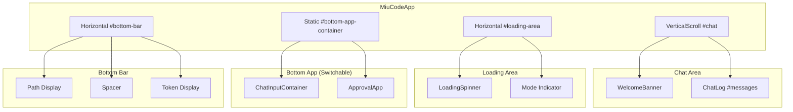
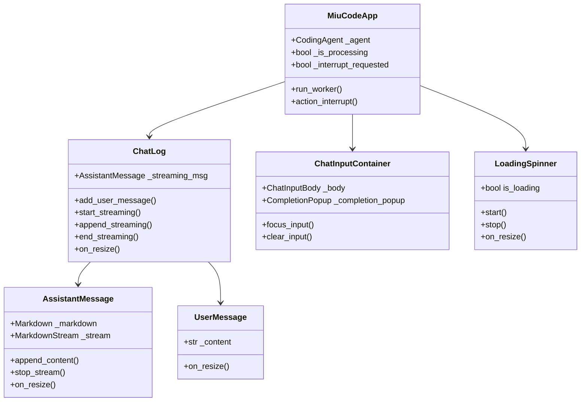
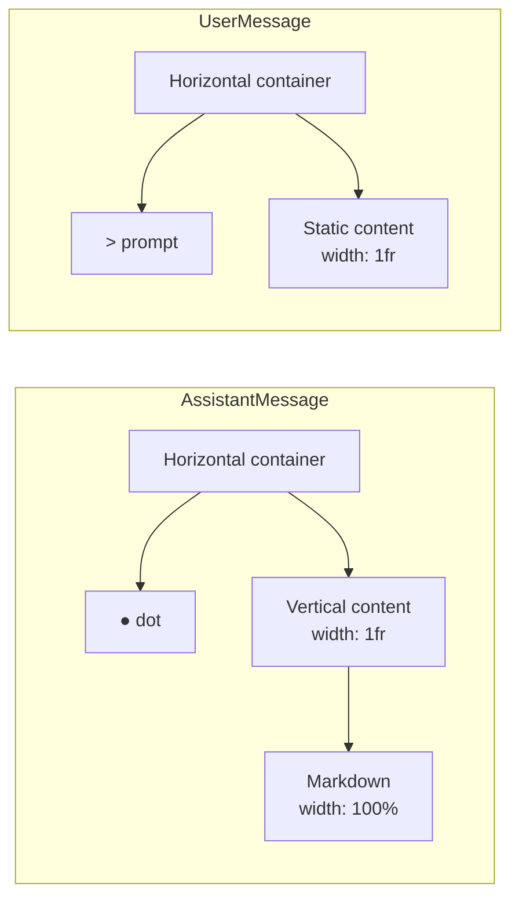
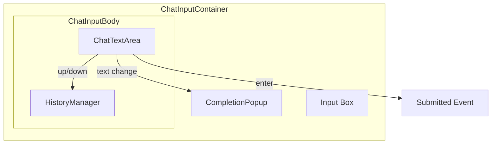
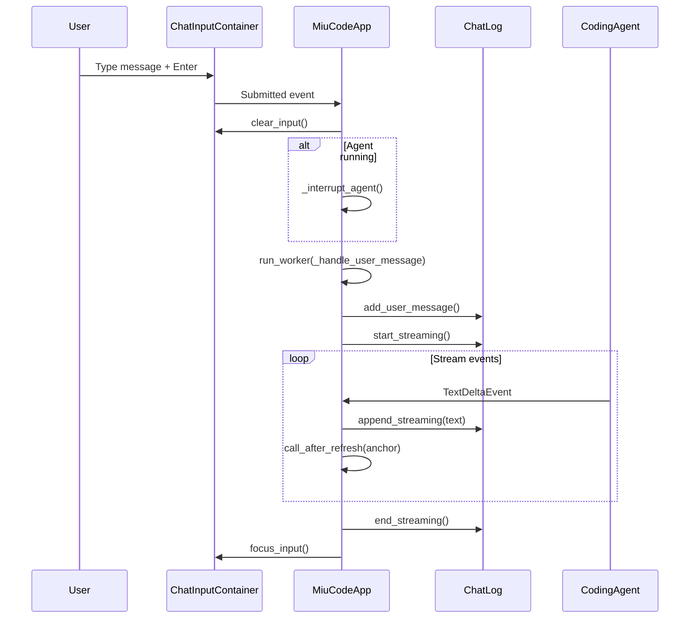
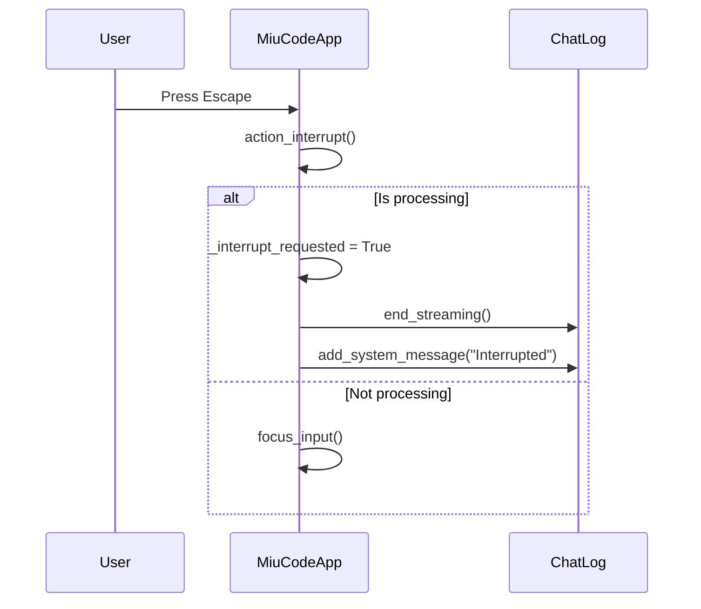
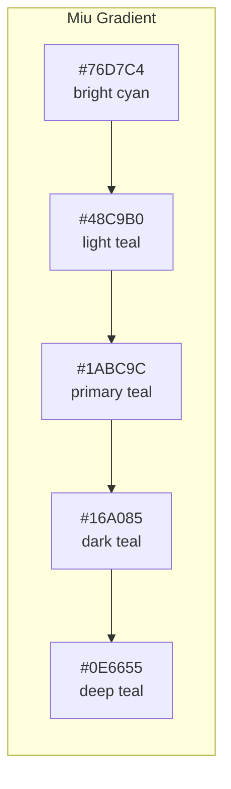

# Miu Code TUI Design

Terminal User Interface design documentation for Miu Code, inspired by [mistral-vibe](https://github.com/mistralai/mistral-vibe).

## Design Philosophy

### Core Principles

1. **Responsive UI** - Never block the event loop; use workers for async operations
2. **Interruptible** - User can always interrupt agent execution (Escape key)
3. **Auto-scroll with override** - Follow new content unless user scrolls up
4. **Minimal chrome** - Focus on content, hide unnecessary UI elements
5. **Consistent theming** - Miu teal brand colors throughout

### Inspiration: mistral-vibe Pattern

Key patterns adopted from mistral-vibe:

- **Worker-based execution**: Agent runs in background worker, UI stays responsive
- **Widget hierarchy**: Proper container nesting with `width: 1fr` for flexible layouts
- **Resize handlers**: All widgets implement `on_resize()` for dynamic layouts
- **Anchor scrolling**: Use `anchor()` method during streaming for smooth scroll

## Architecture Overview



## Widget Hierarchy



## Component Details

### App Layout (app.py)

The main application structure:

| Component | ID | Purpose |
|-----------|-----|---------|
| VerticalScroll | `#chat` | Scrollable message area |
| WelcomeBanner | `#banner` | Logo and metadata |
| ChatLog | `#messages` | Message container with `layout: stream` |
| LoadingSpinner | `#loading-area-content` | Animated loading indicator |
| Static | `#mode-indicator` | Current mode display |
| ChatInputContainer | `#input-container` | User input with history |
| Horizontal | `#bottom-bar` | Path and token display |

### Message Widgets (messages.py)



Key pattern for responsive width:
```
Container (width: 100%)
  └─ Horizontal (width: 100%)
      ├─ Icon (width: auto)
      └─ Content (width: 1fr)  ← Flexible fill
          └─ Markdown (width: 100%)
```

### Chat Input System



Components:
- **ChatInputContainer**: Top-level container with border styling
- **ChatInputBody**: Manages input and history
- **ChatTextArea**: Textual TextArea with custom key handling
- **CompletionPopup**: Autocomplete suggestions (hidden by default)
- **HistoryManager**: Persistent command history

## Event Flow

### Message Submission



### Interrupt Flow



## Theming System (theme.py)

### Brand Colors



### Semantic Colors

| Role | Color | Hex |
|------|-------|-----|
| User | Blue | `#3498DB` |
| Assistant | Teal | `#1ABC9C` |
| System | Gray | `#7F8C8D` |
| Error | Red | `#E74C3C` |
| Thinking | Light Teal | `#48C9B0` |

### Color Utilities

```python
# Gradient animation color
color = get_gradient_color(progress)  # 0.0 to 1.0

# Color interpolation
color = interpolate_color("#1ABC9C", "#48C9B0", 0.5)
```

## Styling (app.tcss)

### Layout Structure

```css
/* Main chat area - scrollable */
#chat {
    height: 1fr;        /* Fill available space */
    scrollbar-gutter: stable;
}

/* Messages container - stream layout */
#messages {
    layout: stream;     /* Vertical flow */
    width: 100%;
    height: auto;
}

/* Input box - bordered */
#input-box {
    border-top: solid $foreground-muted;
    border-bottom: solid $foreground-muted;
}
```

### Border Style Variants

Mode-based input border colors:
- **Default**: `$foreground-muted` (gray)
- **ASK mode**: `#27AE60` (green) - safe mode
- **PLAN mode**: `#F39C12` (orange) - warning

## Key Bindings

| Key | Action | Context |
|-----|--------|---------|
| `Ctrl+C` | Quit | Always |
| `Ctrl+N` | New session | Always |
| `Ctrl+L` | Clear chat | Always |
| `Escape` | Interrupt / Focus input | Always |
| `Shift+Tab` | Cycle mode | Always |
| `Shift+Up` | Scroll chat up | Always |
| `Shift+Down` | Scroll chat down | Always |
| `Up/Down` | History navigation | In input |
| `Enter` | Submit | In input |

## Resize Handling

All widgets that display dynamic content implement `on_resize()`:

```python
def on_resize(self) -> None:
    """Refresh on resize to ensure proper layout."""
    self.refresh()
```

Widgets with resize handlers:
- `WelcomeBanner`
- `ChatLog`
- `AssistantMessage`
- `UserMessage`
- `ReasoningMessage`
- `LoadingSpinner`
- `ExpandingBorder`

## Streaming Best Practices

1. **Use workers for async operations**:
   ```python
   self.run_worker(self._handle_user_message(value), exclusive=False)
   ```

2. **Schedule scroll after refresh**:
   ```python
   self.call_after_refresh(self._anchor_if_scrollable)
   ```

3. **Check interrupt flag in loops**:
   ```python
   async for event in agent.run_stream(query):
       if self._interrupt_requested:
           break
   ```

4. **Proper widget container structure**:
   ```python
   with Horizontal(classes="container"):
       yield Static("●", classes="icon")  # width: auto
       with Vertical(classes="content"):  # width: 1fr
           yield Markdown("")             # width: 100%
   ```

## File Structure

```
miu_code/tui/
├── app.py              # Main application
├── app.tcss            # Stylesheet
├── theme.py            # Colors and gradients
└── widgets/
    ├── banner.py       # Welcome banner
    ├── chat.py         # ChatLog container
    ├── messages.py     # Message widgets
    ├── loading.py      # Loading spinner
    ├── spinner.py      # Spinner mixin
    ├── status.py       # Status bar
    ├── approval.py     # Tool approval dialog
    ├── tools.py        # Tool-related widgets
    └── chat_input/
        ├── container.py      # Input container
        ├── body.py          # Input body
        ├── text_area.py     # Custom TextArea
        ├── history.py       # History manager
        └── completion_popup.py  # Autocomplete
```
